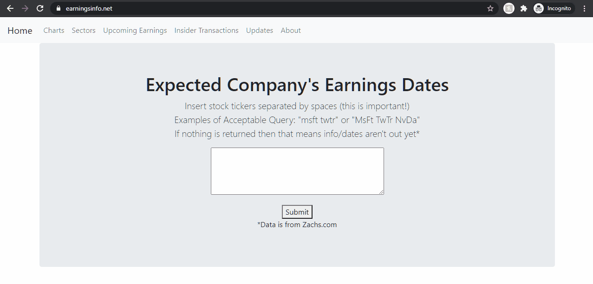

# Stock Earnings Date HTML Scraper
HTML scraper made using Python to get the earnings dates of companie's tickers from Zachs.com

EDIT: I made it into a Flask app, http://www.earningsinfo.net/   
  

This repo only contain the orignal Python script used as the basis/inspiration for the website

# How to Use
Just type any number of stock tickers (doesn't matter casing) separated by spaces

# Built With
Backend: Python, Flask  
Frontend: bootstrap, HTML, CSS, JS (only for Google Analytics)

